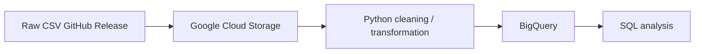

# Brisbane River Water Quality Analysis

Environmental data analytics and data engineering project analysing ~11 months of
high-frequency water-quality sensor data from a monitoring buoy on the Brisbane River,
Australia. Built to demonstrate the combination of environmental science domain knowledge
with Python, SQL, data cleaning, and cloud data engineering.

## Overview

This project investigates water-quality measurements collected every 10-30 minutes from a
river monitoring buoy, and identifies meaningful environmental patterns: seasonal cycles,
daily (diel) oxygen rhythms, and a specific sustained turbidity event that is independently
confirmed by three separate analytical methods across this project (Python, and two
different SQL techniques).

The project is intentionally scoped as a **data analytics and data engineering** project,
not a machine-learning project -- the focus is on rigorous, well-documented cleaning,
exploratory analysis, and SQL, rather than predictive modelling.

## Environmental problem

River water quality is a key indicator of catchment and waterway health. Sudden or sustained
changes in parameters like turbidity, dissolved oxygen, or salinity can signal rainfall
runoff events, pollution, or ecological stress. Understanding the typical range of
conditions at a monitoring site -- and being able to reliably detect genuine departures from
it -- is a practical, real-world environmental monitoring task.

## Research questions

- **RQ1** -- What are the typical water-quality conditions at this site?
- **RQ2** -- Which water-quality parameters show the greatest variability?
- **RQ3** -- How does water quality change over time?
- **RQ4** -- Are there identifiable monthly or seasonal patterns?
- **RQ5** -- What relationships exist between water-quality parameters?
- **RQ6** -- Are there periods of unusual water-quality conditions?

## Dataset

**Source:** [Brisbane River Water Quality Monitoring Dataset](https://www.kaggle.com/datasets/downshift/water-quality-monitoring-dataset)
on Kaggle, originally published by the
[Queensland Government Open Data Portal](https://www.data.qld.gov.au/dataset/brisbane-river-colmslie-site-water-quality-monitoring-buoy)
(Colmslie site). Licensed **Apache 2.0**.

- **30,894 readings** collected roughly every 10-30 minutes from **4 August 2023 to 27 June
  2024** (~11 months).
- **20 raw columns**: timestamp, record number, and 9 physicochemical/hydrological
  parameters, each paired with a sensor quality-flag column.

For full reproducibility, this repository redistributes the raw CSV (permitted under the
dataset's Apache 2.0 licence) as a
[GitHub Release asset](https://github.com/davis-mironga/brisbane-river-water-quality-analysis/releases/tag/v1.0-data).
**Notebook 1 automatically downloads it** if it isn't already present locally -- no Kaggle
account or manual download is required to run this project from a fresh clone.

## Data dictionary

| Column | Description |
|---|---|
| `timestamp` | Reading date/time |
| `record_number` | Unique sensor record identifier |
| `water_speed` | Average water speed (cm/s) |
| `water_direction` | Average water direction (degrees, compass bearing) |
| `chlorophyll` | Chlorophyll concentration (a proxy for algal biomass) |
| `temperature` | Water temperature (deg C) |
| `dissolved_oxygen` | Dissolved oxygen concentration (mg/L) |
| `dissolved_oxygen_pct_sat` | Dissolved oxygen, percent saturation |
| `ph` | pH |
| `salinity` | Salinity (PSU) |
| `specific_conductance` | Specific conductance (a proxy for dissolved-ion content) |
| `turbidity` | Turbidity / water clarity (NTU) |
| `*_quality` | Paired sensor QA/QC flag column for each parameter above |
| `year`, `month`, `day`, `hour`, `day_of_week`, `season` | Engineered time-based features (added in Notebook 1) |

## Methodology

1. **Data understanding & cleaning** (Notebook 1) -- inspect the raw data, investigate every
   data-quality issue with evidence before deciding how to handle it, engineer time-based
   features, export a clean, analysis-ready dataset.
2. **Exploratory analysis** (Notebook 2) -- answer RQ1-RQ6 using descriptive statistics,
   distributions, temporal trends, correlation analysis, and a z-score based anomaly check.
3. **SQL analysis** (sql/) -- reproduce and extend the same investigation directly in SQL
   against a local SQLite database, from basic validation through CTEs and window functions.
4. **Environmental insights** (Notebook 3) -- the final presentation notebook, selecting the
   strongest ~6 findings and framing each as Observation / Environmental Interpretation /
   Limitation.

## Data cleaning

Cleaning decisions were made with evidence, not blanket rules. Key decisions:

- **No rows were removed.** Missingness (up to ~19% in some columns) and extreme values
  were investigated first -- missingness clusters into specific time periods consistent with
  real equipment outages/maintenance, not random noise, and extreme readings are consistent
  with genuine short-lived environmental events (e.g. rainfall/turbidity spikes) rather than
  sensor error.
- Every cleaning decision is documented in Notebook 1 as **PROBLEM / DECISION / REASON /
  IMPACT**.
- A full data-quality summary (original records, duplicates found, records removed, final
  records) is produced at the end of Notebook 1 and reproduced independently in
  sql/01_data_quality.sql.

## Exploratory analysis

Notebook 2 investigates all six research questions using pandas/matplotlib/seaborn:
descriptive statistics, coefficient-of-variation ranking, distribution plots, daily/monthly/
seasonal aggregation, a correlation heatmap, and a z-score based anomaly flag. All
interpretation uses careful, non-causal language ("associated with," "may indicate,"
"warrants further investigation").

## SQL analysis

Four SQL files in sql/, run against a local SQLite database built from the cleaned CSV:

| File | Covers |
|---|---|
| 01_data_quality.sql | Row counts, NULL checks, duplicate detection, physical-plausibility validation |
| 02_temporal_analysis.sql | Yearly/monthly/seasonal/hourly aggregation, month-over-month change |
| 03_water_quality_analysis.sql | CASE-based condition banding, HAVING-filtered aggregate queries |
| 04_environmental_insights.sql | CTEs, window functions, rolling averages, RANK, consecutive-day streak detection |

**Cross-validated finding:** turbidity events on **8-11 April** and **17-23 May 2024** were
independently identified multiple ways -- a Python z-score check (Notebook 2), a SQL
HAVING-threshold query (03_water_quality_analysis.sql), and a SQL consecutive-day streak
detector (04_environmental_insights.sql). Both windows border equipment-outage boundaries
(see Limitations), so while the anomalies themselves are well-evidenced, their cause remains
undetermined between a hydrological event and a sensor/maintenance effect.

## Cloud architecture

(Planned -- see Future Improvements section below)

## Technologies

Python (pandas, numpy, matplotlib, seaborn), Jupyter, SQL (SQLite), Git/GitHub, Google Cloud
(Storage, BigQuery -- planned), GitHub Actions (planned).

## Repository structure

    brisbane-river-water-quality-analysis/
    data/
      raw/            (gitignored; auto-downloaded by Notebook 1)
      processed/      (gitignored; regenerated by running Notebook 1)
    notebooks/
      01_data_understanding_cleaning.ipynb
      02_exploratory_environmental_analysis.ipynb
      03_environmental_insights.ipynb
    sql/
      01_data_quality.sql
      02_temporal_analysis.sql
      03_water_quality_analysis.sql
      04_environmental_insights.sql
    src/                (reusable cleaning/analysis functions -- planned)
    tests/               (unit tests for src/ -- planned)
    visualisations/
    .github/workflows/  (CI -- planned)
    requirements.txt
    README.md

## Key environmental findings

1. Two turbidity events (8-11 April and 17-23 May 2024) were confirmed independently by
   multiple methods (Python z-scores, SQL threshold query, SQL streak detection). Both
   events border equipment-outage periods, which is at least as consistent with sensor
   biofouling or post-outage disturbance as with a rainfall event (see Limitations).
2. Temperature and dissolved oxygen move in opposite seasonal directions, consistent
   with the physical relationship between water temperature and gas solubility.
3. A clear daily (diel) oxygen cycle driven by daylight/photosynthesis, lowest in early
   morning and highest in mid-afternoon.
4. Turbidity is right-skewed, with the May 2024 event standing well outside the typical
   range.
5. Salinity varies by season, plausibly reflecting seasonal river-flow/tidal dynamics.
6. Missing data is not random -- it clusters into specific periods consistent with
   equipment outages, which is why it was not blindly cleaned away.

## Visualisations

See notebooks/03_environmental_insights.ipynb for the full set of ~6 polished
visualisations, and visualisations/ for exported figure images (planned).

## Limitations

- Only ~11 months of data are available -- findings describe one seasonal cycle, not an
  established multi-year trend.
- No external data (rainfall, tides, upstream discharge) was used to confirm the cause of
  the identified turbidity events. Both events border equipment-outage boundaries, so a
  maintenance/biofouling cause is at least as plausible as rainfall, and the dataset alone
  cannot distinguish between them.
- All correlational findings are deliberately worded as association, not causation.

## Future improvements

- Extract proven cleaning/analysis logic from the notebooks into src/cleaning.py and
  src/analysis.py, with unit tests in tests/.
- Build the Google Cloud Storage to BigQuery pipeline shown above.
- Add a GitHub Actions workflow to install dependencies, run tests, and validate the project
  on every push.
- Cross-reference the May/April 2024 turbidity events against Bureau of Meteorology rainfall
  records AND the monitoring program's maintenance/service logs -- both events border
  equipment-outage periods, so a maintenance-related cause is at least as plausible as
  rainfall, and the two hypotheses need to be told apart.

## How to reproduce

    git clone https://github.com/davis-mironga/brisbane-river-water-quality-analysis.git
    cd brisbane-river-water-quality-analysis
    pip install -r requirements.txt

    # Run Notebook 1 first -- it auto-downloads the raw dataset and produces the cleaned CSV
    # that Notebooks 2, 3, and the SQL files all depend on.
    jupyter nbconvert --to notebook --execute notebooks/01_data_understanding_cleaning.ipynb --output 01_data_understanding_cleaning.ipynb

    jupyter nbconvert --to notebook --execute notebooks/02_exploratory_environmental_analysis.ipynb --output 02_exploratory_environmental_analysis.ipynb

    jupyter nbconvert --to notebook --execute notebooks/03_environmental_insights.ipynb --output 03_environmental_insights.ipynb

This also works unmodified in Google Colab (File then Open notebook then GitHub, then clone
the repo as the first cell) -- no Kaggle account or manual upload required.
